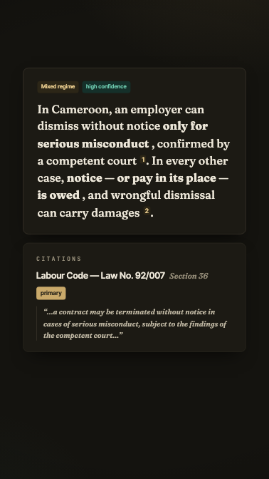
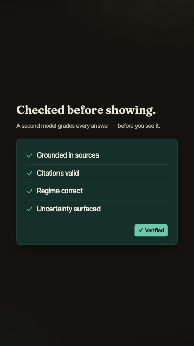
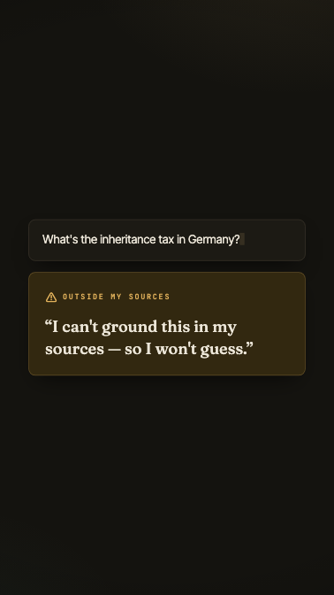
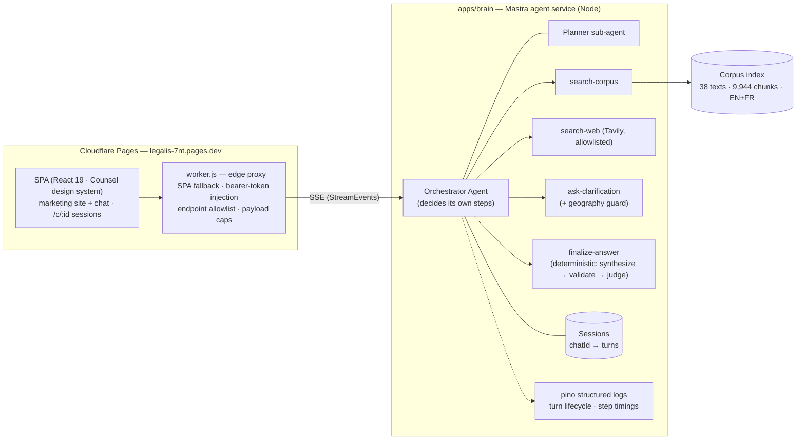
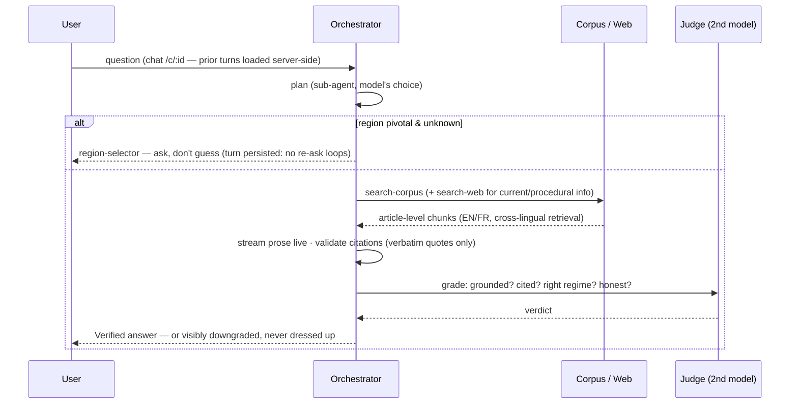

# Legalis

[](https://github.com/gastonche/legalis/actions/workflows/ci.yml)
[](https://legalis-7nt.pages.dev)
[](LICENSE)

**Grounded, guided research on Cameroon law.** Ask a question in plain language; an agent answers
from cited primary sources, flags which legal regime governs (Anglophone common law · Francophone
civil law · OHADA), and a second model grades every answer *before* it's shown. The
*legal information, not legal advice* boundary is enforced in code, not in a footer.

**Live demo:** [legalis-7nt.pages.dev](https://legalis-7nt.pages.dev) · **60s product film:** [`promo/legalis-film`](promo/legalis-film) (Remotion)

<p>
  
  
  
</p>

## Why this project is interesting

Three behaviors are *engineered*, not prompted-and-hoped:

1. **Grounding-only answers.** Every legal claim must trace to a retrieved source — 38 verified
   primary texts (9,944 article-level chunks, EN + FR) plus allowlisted official web sources. A
   citation-integrity layer strips any citation whose source wasn't retrieved or whose quote isn't
   verbatim. No sources → an honest refusal, never a guess.
2. **A self-evaluation gate.** A judge model grades each draft on groundedness, citation validity,
   jurisdiction, and uncertainty honesty *before display*. Failures are visibly downgraded
   ("⚠ I couldn't fully verify this…"), with a bounded revise/re-retrieve loop.
3. **The bijural reality, taken seriously.** Cameroon runs two legal traditions plus OHADA
   supersession on business matters. The agent states the governing regime, and when the
   Anglophone/Francophone divide is pivotal and unknown, it *asks* — a model-driven clarifying
   question with a tool-level guard against re-asking or asking when a town is named.

Everything above is enforced by **two layers of evals that have already caught six real defects**
(see [the findings](#what-the-evals-caught)).

## Architecture

Three services. The model **drives the loop via tool calls** — it decides when to consult the
planner, search the corpus, widen to the web, ask the user, or finalize. The final cited answer is
produced *deterministically* inside the `finalize-answer` tool (`streamProse → structureAnswer →
judge`), so grounding integrity stays outside the model's control.





Every step streams to the SPA as typed `StreamEvent`s (zod contracts) rendering a generative UI: a
collapsible **Thinking** disclosure (narration, sources, verification checks, raw trace)
subordinate to the hero cited answer, with markdown rendered live during token streaming.

### Repo layout

| Path | What it is |
| --- | --- |
| `apps/brain` | The Mastra agent service: orchestrator + planner sub-agent + four tools, file-backed sessions, SSE routes, pino logging. Hosted by Hono under `tsx`. |
| `apps/web` | React 19 + Vite + Tailwind v4 SPA — marketing site (`/`, `/how-it-works`, `/sources`, `/about`, terms/privacy) + the chat (`/chat`, `/c/:id`), plus the Pages edge worker (`public/_worker.js`). |
| `apps/agent` | Cloudflare Worker proxy variant (local dev parity with the edge worker). |
| `packages/contracts` | Zod wire contracts: `StreamEvent`, the `ComponentDirective` registry, `AnswerPayload`, `SelfEvalVerdict`. |
| `packages/core` | The grounded pipeline as a pure library: retrieval fusion, synthesis, citation validation, the judge, the gate, scope-boundary enforcement. |
| `packages/ingestion` | Corpus pipeline: PDF extract (+OCR), structure-aware legal chunking (article-as-unit, heading context, noise stripping), embeddings, vector stores. |
| `packages/evals` | Two layers of Promptopus suites — see below. |
| `promo/legalis-film` | The 60s Remotion hero film (no VO; psychology-driven scene design; free sound). |
| `corpus/` | The verified primary-law corpus (manifest committed; PDFs/index gitignored). |

## Evals: behavior contracts + deep model evals

Built on [Promptopus](https://promptopus.pages.dev). Two layers:

**Layer 1 — keyless behavior contracts (`pnpm eval`, runs in CI on every push).** Deterministic
scripted LLMs (including an *adversarial fabricator* that invents statutes and case law) over
committed real-corpus fixtures, through the **real pipeline**. Three suites / 26 checks: grounded
answers (EN + FR), honest refusal, citation integrity. Zero keys, CI-stable, fails the build on
regression.

**Layer 2 — deep model evals (`pnpm eval:deep`).** Real models over the real corpus index,
covering **every AI call site**: the planner classification, synthesis + the judge gate
(**gpt-4o-mini vs gpt-4o side by side**, with LLM-as-judge faithfulness graded against actual
statute text), and the **live orchestrator over SSE** (decision grading: did it ask? did it search
the web?). 49 checks; results open in the Promptopus dashboard
(`npx promptopus view packages/evals/results/deep-gate.json`).

### What the evals caught

The harness paid for itself before launch — six real defects, each fixed and re-verified:

| # | Finding | Caught by | Fix |
| --- | --- | --- | --- |
| 1 | **Gate trust hole** — when fabricated citations were stripped, the *banner* said Unverified but the confident fabricated *text* survived untouched | adversarial fabricator suite | hedge-aware `downgradeAnswer` applied on every non-show outcome, across all three pipelines |
| 2 | **Scope boundary was prompt-hope** — real models paraphrased away the explicit "information, not advice" statement | deep gate suite | `enforceScopeBoundary()` appends the canonical boundary deterministically in core |
| 3 | **gpt-4o-mini misclassified FR company-law** as `mixed` instead of `ohada` | deep gate suite (FR case) | regime guidance added to synthesis prompts — verified fixed on re-run |
| 4 | **TOC junk in the corpus index** — space-separated dot-leaders (`Article 1 . . . .`) slipped past the chunker's noise filter | fixture extraction | `NOISE` regex extended (applies on next ingest) |
| 5 | **FR retrieval is thin** for broad definitional questions — the gate honestly downgrades | deep gate suite | corpus roadmap item (add AUSCGIE scope articles); judge threshold baselined at 0.5 with a written rationale to raise it |
| 6 | **The bigger model didn't win** — gpt-4o matched gpt-4o-mini's pass rate, and the one gate-downgraded answer was gpt-4o's | deep gate comparison | informs the default-model choice: retrieval + the gate dominate; 4o-mini stays the default |

Current state: **26/26 keyless · 49/49 deep**, with the FR threshold documented as a baseline, not
an aspiration.

## Observability

- **Brain:** structured pino logs — `turn.start` → per-step timings (`retrieve`, `reflect`,
  `synthesize`, `self-eval`) → `turn.end` with outcome, banner status, citation count, regime, and
  duration; request-scoped ids; JSON in production, pretty in dev (`LOG_LEVEL=debug` for step
  timings).
- **Edge:** Cloudflare Workers observability enabled; the Pages worker allowlists endpoints and
  caps payloads.
- **Evals as monitoring:** CI uploads the eval report as an artifact on every push; the deep suite
  runs on `workflow_dispatch` with the API key as a repo secret.

## Deployment

Live at **[legalis-7nt.pages.dev](https://legalis-7nt.pages.dev)**: the SPA + edge proxy ship as
one Cloudflare Pages deployment (`_worker.js` advanced mode — static assets, SPA fallback for
`/c/*`, and an authenticated proxy to the brain). The brain requires Node (onnxruntime embeddings +
an 89 MB local index), is hardened for exposure (bearer token only the edge knows, per-chat turn
caps, question-length caps), and runs via a Cloudflare Tunnel in beta with a container host
(Fly/Railway) as the stable path. The all-Cloudflare migration (Workers AI + Vectorize + D1) is
prepared — the REST adapters exist in `packages/ingestion` — pending a re-ingest at 1024d.

## Running it locally

Prereqs: Node ≥ 22.13, pnpm 10. Secrets in `apps/brain/.env` (`OPENAI_API_KEY`, optional
`TAVILY_API_KEY` — web search degrades off without it).

```bash
pnpm install
pnpm ingest                          # one-time: build the local corpus index

pnpm --filter @legalis/brain dev     # 1. agent service  → :4111
pnpm --filter @legalis/agent dev     # 2. dev proxy      → :8787
pnpm --filter @legalis/web dev       # 3. SPA            → :5173
```

```bash
pnpm typecheck && pnpm lint          # strict TS, no `any` in core logic
pnpm eval                            # behavior contracts (keyless)
pnpm eval:deep                       # real-model evals (needs OPENAI_API_KEY)
```

## Honest limitations

- **Not legal advice** — by design and by enforced behavior; decisions belong with a qualified
  Cameroonian lawyer.
- Web-grounded answers are conservatively downgraded (the verbatim-quote validator is strict on
  messy web text) — the known top quality lever.
- The corpus is 38 texts and growing; gaps produce honest refusals, with FR definitional retrieval
  the documented weak spot (finding #5).
- Beta conversations are stored server-side per chat id; don't paste sensitive details.
