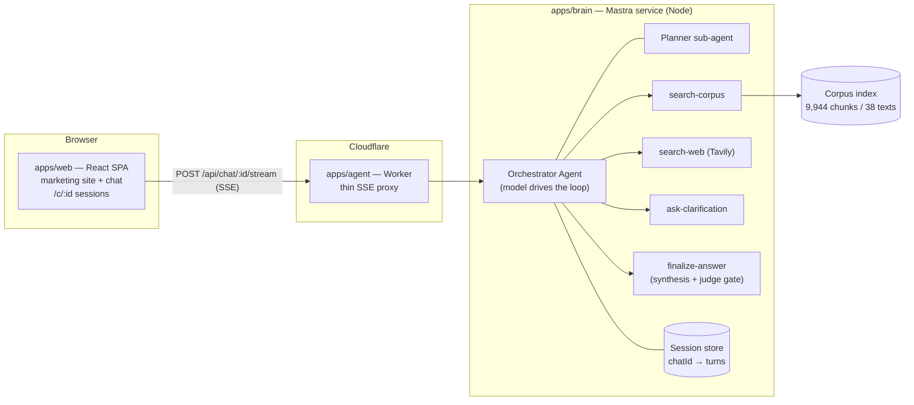
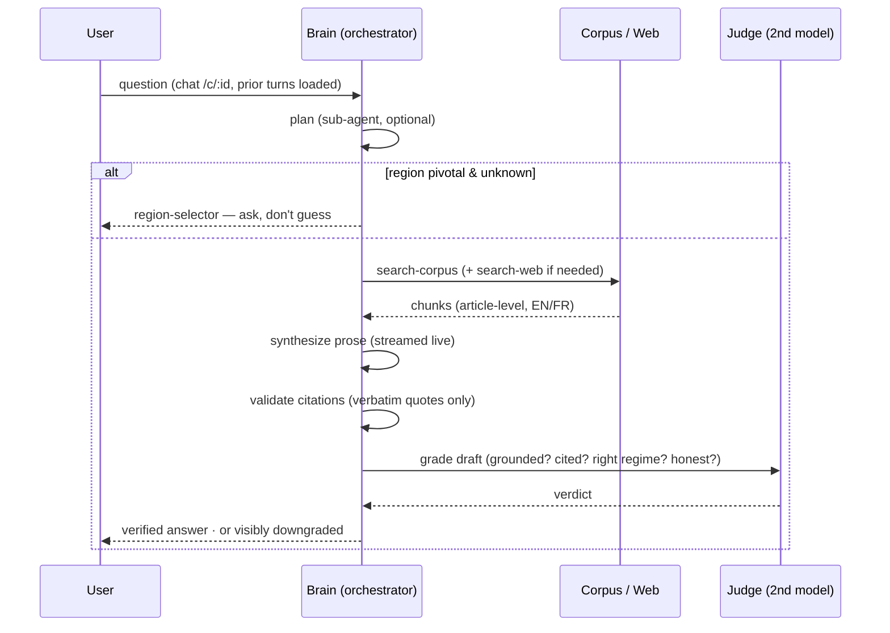

# Legalis

[](https://github.com/OWNER/legalis/actions/workflows/ci.yml)
<!-- Replace OWNER once the GitHub remote exists. -->

**Grounded, guided research on Cameroon law.** Ask a question in plain language; Legalis answers
from cited primary sources, flags which legal regime governs (Anglophone common law · Francophone
civil law · OHADA), self-checks every answer before showing it, and consistently draws the
*legal information, not legal advice* boundary.

Three engineered behaviors define the product:

1. **Grounding-only answers** — every legal claim must trace to a retrieved source (38 verified
   primary texts + allowlisted official web sources). A citation-integrity layer strips any
   citation whose source wasn't retrieved or whose quote isn't verbatim. When sources don't
   support an answer, Legalis refuses honestly instead of guessing.
2. **A self-evaluation gate** — a second model grades every draft (groundedness, citation
   validity, jurisdiction, uncertainty honesty) *before* display. Failing answers are visibly
   downgraded, never dressed up.
3. **The bijural question, taken seriously** — answers state the governing regime, note OHADA
   supersession on business matters, and when the Anglophone/Francophone divide is pivotal and
   unknown, the agent *asks* (a model-driven clarifying question) rather than guessing.

## Architecture

Three services in a Turborepo:



The **orchestrator decides its own steps** via tool calls — when to consult the planner, search
the corpus, widen to official web sources, ask the user a clarifying question, or finalize. The
final answer itself is produced deterministically (`streamProse → structureAnswer → judge`) inside
the `finalize-answer` tool, so grounding integrity and the grade-before-show gate stay outside the
model's control.



Every step streams to the SPA as typed `StreamEvent`s (trace / narration / component /
answer-token) rendering a generative UI: a collapsible **Thinking** disclosure (process,
sources, verification checks, raw trace) subordinate to the hero cited answer.

### Repo layout

| path | what it is |
| --- | --- |
| `apps/brain` | The Mastra agent service: orchestrator + planner sub-agent + tools, sessions, SSE routes. Hosted by a thin Hono server under `tsx` in dev. |
| `apps/agent` | Cloudflare Worker — stateless SSE/JSON proxy to the brain (`BRAIN_URL`). |
| `apps/web` | React 19 + Vite + Tailwind v4 SPA: marketing site (`/`, `/how-it-works`, `/sources`, `/about`, terms/privacy) + the chat app (`/chat`, `/c/:id`). |
| `packages/contracts` | Zod contracts: `StreamEvent`, `ComponentDirective` registry, `AnswerPayload`, `SelfEvalVerdict`. The wire format everything agrees on. |
| `packages/core` | The grounded pipeline: retrieval fusion, synthesis, citation validation, judge, gate. Pure library, consumed in-process by the brain and the evals. |
| `packages/ingestion` | Corpus pipeline: PDF extract (+OCR), structure-aware legal chunking (article-as-unit, heading context), embeddings, vector stores, CLIs. |
| `packages/evals` | Promptopus behavior suites (offline, keyless) — see below. |
| `corpus/` | The verified primary-law corpus (manifest committed; PDFs/index gitignored). |

## Running it

Prereqs: Node ≥ 22.13, pnpm 10. Secrets live in `apps/brain/.env` (gitignored):
`OPENAI_API_KEY`, optional `TAVILY_API_KEY` (web search degrades off without it).

```bash
pnpm install

# one-time: build the local corpus index (downloads the embedding model on first run)
pnpm ingest

# then, in three terminals (order matters):
pnpm --filter @legalis/brain dev    # 1. Mastra brain    → :4111
pnpm --filter @legalis/agent dev    # 2. Worker proxy    → :8787
pnpm --filter @legalis/web dev      # 3. SPA             → :5173
```

Open http://localhost:5173. Dev runs fully locally: in-process Transformers.js embeddings over a
file-backed index, file-backed sessions. Deploy swaps these for Workers AI + Vectorize and a
remote store via Mastra's `CloudflareDeployer` (the Worker proxy is already Cloudflare-native).

## Evals: behavior, not vibes

`pnpm eval` runs [Promptopus](https://promptopus.pages.dev) suites against the **real pipeline**
(retrieve → synthesize → citation-validate → gate) with deterministic scripted LLMs and committed
corpus fixtures — zero keys, CI-stable:

- **grounded-answers** — cites the right document (Labour Code / OHADA AUDCG / Constitution),
  classifies the regime, passes the gate, carries the advice boundary. EN + FR.
- **honest-refusal** — out-of-corpus questions (German tax, Nigerian fines) produce refusals:
  no citations, low confidence, downgraded banner.
- **citation-integrity** — adversarial: a model that *fabricates* statutes and cases. The
  integrity layer must strip every invented citation and the gate must visibly downgrade.

The suites run on every push (`.github/workflows/ci.yml`) and fail the build on any regression;
the report uploads as a CI artifact. The harness has already caught real bugs: an ungrounded-draft
path that skipped the visible downgrade, and TOC dot-leader noise in the chunker.

### Deep model evals (real models, every AI call site)

`pnpm eval:deep` goes a level deeper: **real models** over the **real corpus index**, covering all
four places Legalis uses AI —

| suite | AI call site | what it grades |
| --- | --- | --- |
| `deep-planner` | the planner classification | domain/regime, web-need, the pivotal-region flag (ask-don't-guess) |
| `deep-gate` | synthesis + the self-eval judge gate | grounded citations, regime, the gate's honesty, **LLM-as-judge faithfulness** against statute text + quality rubrics, latency budgets — compared **side-by-side across models** (gpt-4o-mini vs gpt-4o) |
| `deep-orchestrator` | the live Mastra agent (over SSE) | tool decisions end-to-end: asks the region clarifier when pivotal, doesn't when a town is named, widens to web for current/procedural questions |

It's env-gated (`OPENAI_API_KEY`; the orchestrator suite needs the brain running and auto-skips
otherwise) and runnable in CI via `workflow_dispatch` with the key as a repo secret. Inspect any
run interactively in the Promptopus dashboard: `npx promptopus view packages/evals/results/deep-gate.json`.

The deep layer immediately earned its keep: it caught models writing a *paraphrased* scope note
instead of the explicit information-not-advice boundary (now enforced deterministically in core —
`enforceScopeBoundary`), and gpt-4o-mini misclassifying FR company-law questions as `mixed`
instead of `ohada` (fixed with regime guidance in the synthesis prompts).

## Honest limitations

- **Not legal advice** — by design and by behavior. Decisions belong with a qualified
  Cameroonian lawyer.
- Web-grounded answers are conservatively downgraded (the verbatim-quote validator is strict on
  messy web text) — tracked as the main quality lever.
- The corpus is 38 texts and growing; coverage gaps produce honest refusals, not answers.
- Conversations are stored server-side per chat id during the beta; don't paste sensitive details.
